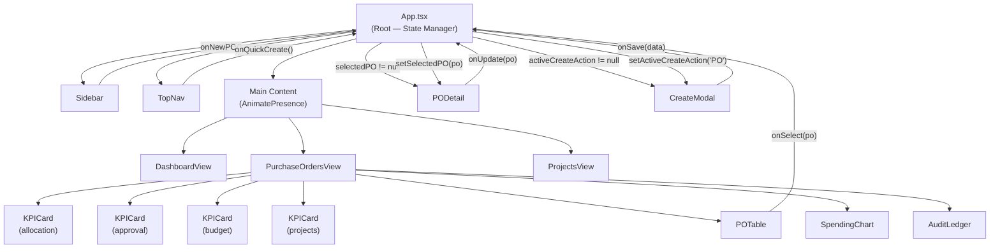
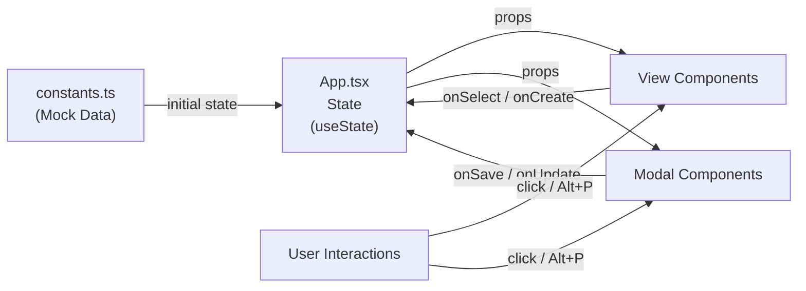
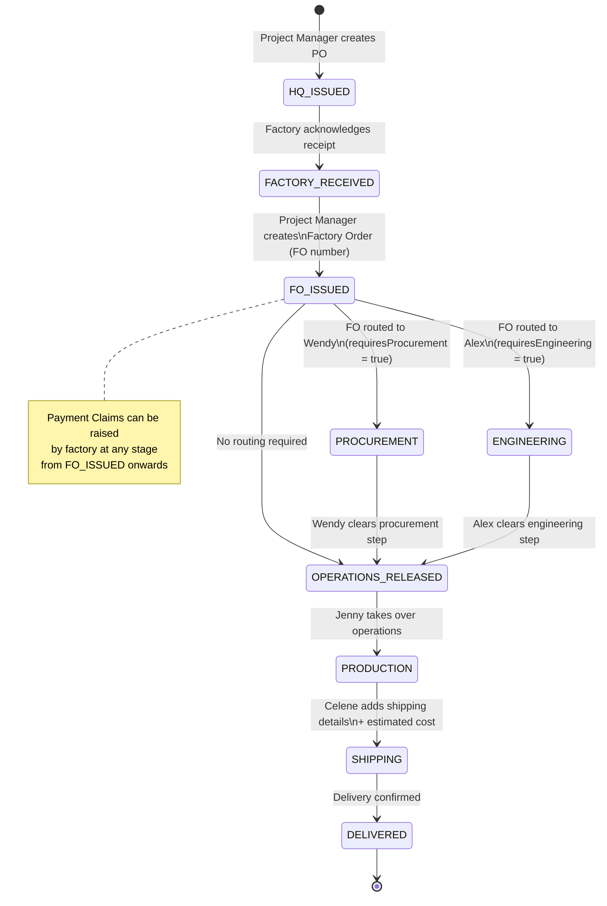

# ProcureArch Operations — App Structure & Component Diagram

## Component Hierarchy

```
App (src/App.tsx)
├── Sidebar (src/components/Sidebar.tsx)
│   ├── Branding: Building2 icon + "ProcureArch Operations"
│   ├── Nav Items: Dashboard, Purchase Orders, Projects
│   ├── Create New PO button
│   └── Support / Archive links (static)
│
├── TopNav (src/components/TopNav.tsx)
│   ├── Nav links: Dashboard, Purchase Orders, Projects
│   ├── Search bar (UI only, non-functional)
│   ├── Notifications bell
│   ├── Settings button
│   └── User: Marcus Thorne, Head of Procurement
│
├── Main Content Area (AnimatePresence for transitions)
│   ├── DashboardView (src/components/DashboardView.tsx)
│   │   ├── Metric Cards: Total Revenue, Active Users, Avg. Lead Time
│   │   └── Operational Efficiency placeholder
│   │
│   ├── PurchaseOrdersView (src/components/PurchaseOrdersView.tsx)
│   │   ├── Header: title + Export Ledger + Create PO buttons
│   │   ├── Filter Bar: Status / Project / Fiscal Year dropdowns
│   │   ├── KPICard[] (4 cards — src/components/KPICard.tsx)
│   │   ├── POTable (src/components/POTable.tsx)
│   │   │   └── Rows: PO Number, Project, Stage, Date, Amount, Status, Actions
│   │   ├── SpendingChart (src/components/SpendingChart.tsx)
│   │   └── AuditLedger (src/components/AuditLedger.tsx)
│   │
│   └── ProjectsView (src/components/ProjectsView.tsx)
│       └── Project Cards (4 hardcoded projects with progress bars)
│
├── PODetail Modal (src/components/PODetail.tsx) [conditional]
│   ├── 9-Stage Lifecycle Stepper
│   ├── Current Status + Action Buttons
│   ├── Factory Order (FO) section — link FO number, route to Procurement/Engineering
│   ├── Order Items list (from po_Item catalog)
│   ├── Payment Claims (appendable — factory raises against PO cost)
│   └── Shipping Information (addable by Celene — includes estimated cost)
│
└── CreateModal (src/components/CreateModal.tsx) [conditional]
    ├── PO Number (auto-generated)
    ├── Project Name + Code inputs
    ├── Dynamic Item list (description + type)
    └── Requirements checkboxes (Procurement, Engineering)
```

---

## Mermaid — Full Component Diagram



---

## Mermaid — Data Flow Diagram



---

## Mermaid — PO & FO Process Lifecycle



---

## State Management

**All state lives in `App.tsx`** — no Context API or external store.

```typescript
// App.tsx state
const [currentView, setCurrentView]           = useState<View>('Purchase Orders')
const [purchaseOrders, setPurchaseOrders]     = useState<PurchaseOrder[]>(INITIAL_POS)
const [selectedPO, setSelectedPO]             = useState<PurchaseOrder | null>(null)
const [activeCreateAction, setActiveCreateAction] = useState<CreateAction>(null)
```

**Props flow** is top-down: App → Views → Sub-components.

No async fetching currently — all data is synchronous from `constants.ts`.

---

## File Map

```
src/
├── App.tsx                    Root — state, routing, modal control
├── main.tsx                   React DOM entry point
├── types.ts                   All interfaces and type definitions
├── constants.ts               Mock data (PURCHASE_ORDERS, KPI_STATS, etc.)
├── index.css                  Tailwind config + custom design tokens
└── components/
    ├── Sidebar.tsx            Left navigation panel
    ├── TopNav.tsx             Top header bar
    ├── DashboardView.tsx      Dashboard page
    ├── PurchaseOrdersView.tsx Purchase Orders page (main)
    ├── POTable.tsx            PO list table
    ├── PODetail.tsx           PO detail modal
    ├── KPICard.tsx            KPI metric card
    ├── SpendingChart.tsx      Bar chart for project spend
    ├── AuditLedger.tsx        Activity log panel
    ├── CreateModal.tsx        Create PO modal form
    ├── ProjectsView.tsx       Projects portfolio page
    └── ReportsView.tsx        Reports page (not wired to nav)
```

---

## Keyboard Shortcuts

| Shortcut | Action |
|---|---|
| `Alt + P` | Open Create PO modal |

---

## Layout Grid

```
┌─────────────────────────────────────────────────────┐
│  TopNav (fixed, z-40, full width)                   │
├──────────┬──────────────────────────────────────────┤
│ Sidebar  │  Main Content Area                       │
│ (fixed,  │  ml-64 pt-16 p-8                         │
│ 16rem,   │                                          │
│ z-50)    │  ┌────────────────────────────────────┐  │
│          │  │  Current View (animated transition) │  │
│          │  └────────────────────────────────────┘  │
│          │                                          │
│          │  [PODetail Modal - overlay]              │
│          │  [CreateModal - overlay]                 │
└──────────┴──────────────────────────────────────────┘
```

---

*Context file — keep updated as components are added or refactored.*
*Related: `00_overview.md`, `03_purchase_orders.md`, `04_po_detail.md`*
