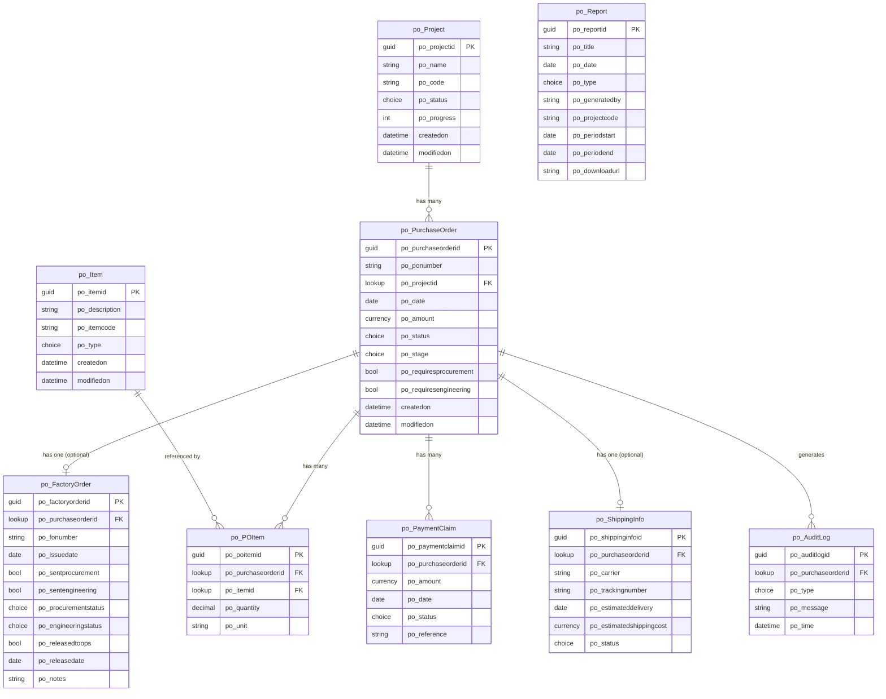

# ProcureArch Operations — Database Schema (Dataverse)

## Overview

All data will be stored in **Microsoft Dataverse** within the **Advanced Aquarium Technologies** environment:
- **Environment URL:** `https://org29840e8d.crm6.dynamics.com/`
- **Authenticated as:** `antonio@advanced-aquariums.com`
- **Region:** Australia/Asia-Pacific (crm6)

Tables use the publisher prefix `po_` to namespace all custom columns and tables.

---

## Entity Relationship Diagram

> **`po_Project` is the root table — single source of truth for all project identity.**
> **`po_Item` is the master items catalog — single source of truth for all item definitions.**
> All POs must link to a Project. All PO line items must link to a master Item.



---

## Table Definitions

### 1. `po_Project` — Projects ⭐ Root Table / Source of Truth

> This is the **root table**. No PO can exist without a linked Project.
> Project Name and Code are the canonical identity for all procurement activity.

| Column Name | Display Name | Type | Required | Notes |
|---|---|---|---|---|
| `po_projectid` | Project ID | Primary Key (GUID) | Auto | System |
| `po_name` | Project Name | Text (100) | Yes | e.g., "Great Barrier Reef Exhibit" |
| `po_code` | Project Code | Text (50) | Yes | e.g., "EXH-GBR-402", must be unique |
| `po_status` | Status | Choice | Yes | In Progress, Planning, On Hold, Completed |
| `po_progress` | Progress | Whole Number | No | 0–100, calculated from PO stages |
| `createdon` | Created On | Date & Time | Auto | System |
| `modifiedon` | Modified On | Date & Time | Auto | System |

---

### 2. `po_Item` — Items Master Catalog ⭐ Source of Truth for Items

> This is the **master items catalog**. All PO line items must reference an item from this table.
> The `po_itemcode` field is reserved for future ERP synchronisation — leave blank for now.

| Column Name | Display Name | Type | Required | Notes |
|---|---|---|---|---|
| `po_itemid` | Item ID | Primary Key (GUID) | Auto | System |
| `po_description` | Description | Text (200) | Yes | e.g., "Acrylic Panels 200mm" |
| `po_itemcode` | Item Code | Text (50) | No | Reserved for ERP sync — leave blank initially |
| `po_type` | Product Type | Choice | Yes | See type values below |
| `createdon` | Created On | Date & Time | Auto | System |
| `modifiedon` | Modified On | Date & Time | Auto | System |

**`po_type` Choice values:**
`Tanks`, `LSS`, `Acrylic`, `Rockwork`, `Components`, `Electrical`, `Other`

---

### 3. `po_PurchaseOrder` — Purchase Orders

> Must be linked to a `po_Project`. Project Name and Code are resolved via the lookup — no free text duplication.

| Column Name | Display Name | Type | Required | Notes |
|---|---|---|---|---|
| `po_purchaseorderid` | PO ID | Primary Key (GUID) | Auto | System |
| `po_ponumber` | PO Number | Text (50) | Yes | e.g., "#PO-24-GBR-01", use auto-number column |
| `po_projectid` | Project | Lookup → po_Project | Yes | FK to Project — enforces project must exist first |
| `po_date` | PO Date | Date Only | Yes | Issuance date |
| `po_amount` | Amount | Currency (USD) | No | Total PO value, set manually or via claims |
| `po_status` | Status | Choice | Yes | Approved, Pending, Rejected |
| `po_stage` | Stage | Choice | Yes | See stage values below |
| `po_requiresprocurement` | Requires Procurement | Yes/No | Yes | Default: No |
| `po_requiresengineering` | Requires Engineering | Yes/No | Yes | Default: No |
| `createdon` | Created On | Date & Time | Auto | System |
| `modifiedon` | Modified On | Date & Time | Auto | System |

**`po_stage` Choice values (9 stages):**
`HQ_ISSUED`, `FACTORY_RECEIVED`, `FO_ISSUED`, `PROCUREMENT`, `ENGINEERING`, `OPERATIONS_RELEASED`, `PRODUCTION`, `SHIPPING`, `DELIVERED`

**`po_status` Choice values:**
`Approved`, `Pending`, `Rejected`

> Note: `po_projectname` and `po_projectcode` are removed as standalone text columns.
> They are now resolved at query time via `$expand=po_projectid($select=po_name,po_code)`.

---

### 4. `po_FactoryOrder` — Factory Orders

> Created by the **Project Manager** once the factory receives the PO.
> Carries the factory's reference number and drives the internal routing workflow (Procurement → Engineering → Operations).
> One FO per PO (1:1 optional relationship — not all POs will have an FO immediately).

| Column Name | Display Name | Type | Required | Notes |
|---|---|---|---|---|
| `po_factoryorderid` | FO ID | Primary Key (GUID) | Auto | System |
| `po_purchaseorderid` | Purchase Order | Lookup → po_PurchaseOrder | Yes | FK, 1:1 |
| `po_fonumber` | FO Number | Text (50) | Yes | Factory's reference number, e.g., `FO-2024-0381` |
| `po_issuedate` | Issue Date | Date Only | Yes | Date PM created/linked the FO |
| `po_sentprocurement` | Sent to Procurement | Yes/No | Yes | Default: No |
| `po_sentengineering` | Sent to Engineering | Yes/No | Yes | Default: No |
| `po_procurementstatus` | Procurement Status | Choice | Yes | Not Required, Pending, Cleared |
| `po_engineeringstatus` | Engineering Status | Choice | Yes | Not Required, Pending, Cleared |
| `po_releasedtoops` | Released to Ops | Yes/No | Yes | Default: No |
| `po_releasedate` | Release Date | Date Only | No | Date FO was released to Operations |
| `po_notes` | Notes | Multiline Text | No | Internal notes from PM, Wendy, or Alex |
| `createdon` | Created On | Date & Time | Auto | System |
| `modifiedon` | Modified On | Date & Time | Auto | System |

**`po_procurementstatus` / `po_engineeringstatus` Choice values:**
`Not Required`, `Pending`, `Cleared`

**Routing rules:**
- `po_sentprocurement = true` → triggers notification to `wendy@advanced-aquariums.com`
- `po_sentengineering = true` → triggers notification to `alex@advanced-aquariums.com`
- `po_releasedtoops = true` (only when all required statuses = Cleared) → triggers notification to `jenny@advanced-aquariums.com` + advances PO stage to `OPERATIONS_RELEASED`

---

### 5. `po_POItem` — PO Line Items

> Each line item references a master item from `po_Item`. Description and type are not re-entered — they come from the catalog lookup.

| Column Name | Display Name | Type | Required | Notes |
|---|---|---|---|---|
| `po_poitemid` | Line Item ID | Primary Key (GUID) | Auto | System |
| `po_purchaseorderid` | Purchase Order | Lookup → po_PurchaseOrder | Yes | FK, cascade delete |
| `po_itemid` | Item | Lookup → po_Item | Yes | FK to master catalog |
| `po_quantity` | Quantity | Decimal | No | |
| `po_unit` | Unit | Text (20) | No | e.g., "pcs", "m", "unit" |

---

### 5. `po_PaymentClaim` — Payment Claims

| Column Name | Display Name | Type | Required | Notes |
|---|---|---|---|---|
| `po_paymentclaimid` | Claim ID | Primary Key (GUID) | Auto | System |
| `po_purchaseorderid` | Purchase Order | Lookup → po_PurchaseOrder | Yes | FK, cascade delete |
| `po_amount` | Amount | Currency (USD) | Yes | |
| `po_date` | Claim Date | Date Only | Yes | |
| `po_status` | Status | Choice | Yes | Pending, Approved, Paid |
| `po_reference` | Reference | Text (50) | Yes | e.g., "INV-001" |

---

### 7. `po_ShippingInfo` — Shipping Information

> Added by **Celene** (celene@advanced-aquariums.com) from the Logistics team at the PRODUCTION or SHIPPING stage.

| Column Name | Display Name | Type | Required | Notes |
|---|---|---|---|---|
| `po_shippinginfoid` | Shipping ID | Primary Key (GUID) | Auto | System |
| `po_purchaseorderid` | Purchase Order | Lookup → po_PurchaseOrder | Yes | FK, 1:1 |
| `po_carrier` | Carrier | Text (100) | No | e.g., "Global Logistics" |
| `po_trackingnumber` | Tracking Number | Text (100) | No | |
| `po_estimateddelivery` | Est. Delivery | Date Only | No | |
| `po_estimatedshippingcost` | Est. Shipping Cost | Currency (USD) | No | Added by Celene at time of booking |
| `po_status` | Status | Choice | No | In Transit, At Port, Delivered |

---

### 8. `po_AuditLog` — Audit Logs

| Column Name | Display Name | Type | Required | Notes |
|---|---|---|---|---|
| `po_auditlogid` | Log ID | Primary Key (GUID) | Auto | System |
| `po_purchaseorderid` | Purchase Order | Lookup → po_PurchaseOrder | No | Optional FK |
| `po_type` | Type | Choice | Yes | Allocation Approved, Internal Draft, Exceeded Ceiling |
| `po_message` | Message | Text (500) | Yes | Human-readable log message |
| `po_time` | Time | Date & Time | Yes | Timestamp of event |

---

### 9. `po_Report` — Reports

| Column Name | Display Name | Type | Required | Notes |
|---|---|---|---|---|
| `po_reportid` | Report ID | Primary Key (GUID) | Auto | System |
| `po_title` | Title | Text (200) | Yes | |
| `po_date` | Date | Date Only | Yes | Generation date |
| `po_type` | Type | Choice | Yes | Financial, Operational, Logistics |
| `po_generatedby` | Generated By | Text (100) | No | User email or name |
| `po_projectcode` | Project Code | Text (50) | No | Filter scope |
| `po_periodstart` | Period Start | Date Only | No | |
| `po_periodend` | Period End | Date Only | No | |
| `po_downloadurl` | Download URL | URL | No | Link to export file |

---

## Relationships Summary

```
po_Project          1 ──< po_PurchaseOrder     (by po_projectid lookup, REQUIRED)
po_Item             1 ──< po_POItem             (by po_itemid lookup, REQUIRED)
po_PurchaseOrder    1 ──o po_FactoryOrder       (by po_purchaseorderid, optional 1:1)
po_PurchaseOrder    1 ──< po_POItem             (by po_purchaseorderid, cascade delete)
po_PurchaseOrder    1 ──< po_PaymentClaim       (by po_purchaseorderid, cascade delete)
po_PurchaseOrder    1 ──o po_ShippingInfo       (by po_purchaseorderid, optional 1:1)
po_PurchaseOrder    1 ──< po_AuditLog           (by po_purchaseorderid, optional)
```

---

## Creation Order (Dependency Order)

Create tables in this order to avoid FK dependency issues:
1. `po_Project`       ← root, no dependencies
2. `po_Item`          ← root catalog, no dependencies
3. `po_PurchaseOrder` (references po_Project)
4. `po_FactoryOrder`  (references po_PurchaseOrder)
5. `po_POItem`        (references po_PurchaseOrder + po_Item)
6. `po_PaymentClaim`  (references po_PurchaseOrder)
7. `po_ShippingInfo`  (references po_PurchaseOrder)
8. `po_AuditLog`      (references po_PurchaseOrder)
9. `po_Report`        (standalone)

---

## OData Query Examples

```
# All projects (root — always start here)
GET /api/data/v9.2/po_projects?$orderby=po_name asc

# All items in master catalog
GET /api/data/v9.2/po_items?$orderby=po_type asc,po_description asc

# All POs for a project with project name/code expanded
GET /api/data/v9.2/po_purchaseorders?$filter=_po_projectid_value eq {guid}&$expand=po_projectid($select=po_name,po_code)&$orderby=createdon desc

# Full PO detail — all child records expanded
GET /api/data/v9.2/po_purchaseorders(guid)?$expand=
  po_projectid($select=po_name,po_code),
  po_FactoryOrder_PurchaseOrder,
  po_POItem_PurchaseOrder($expand=po_itemid($select=po_description,po_itemcode,po_type)),
  po_PaymentClaim_PurchaseOrder,
  po_ShippingInfo_PurchaseOrder

# FOs pending procurement clearance (Wendy's queue)
GET /api/data/v9.2/po_factoryorders?$filter=po_procurementstatus eq 'Pending'&$expand=po_purchaseorderid($select=po_ponumber,po_stage)

# FOs pending engineering clearance (Alex's queue)
GET /api/data/v9.2/po_factoryorders?$filter=po_engineeringstatus eq 'Pending'&$expand=po_purchaseorderid($select=po_ponumber,po_stage)

# Recent audit logs
GET /api/data/v9.2/po_auditlogs?$orderby=po_time desc&$top=10

# All POs at SHIPPING stage (Celene's view)
GET /api/data/v9.2/po_purchaseorders?$filter=po_stage eq 'SHIPPING'&$expand=po_ShippingInfo_PurchaseOrder,po_projectid($select=po_name,po_code)
```

---

*Context file — update as tables are created and columns are confirmed in Dataverse.*
*Related: `00_overview.md`, `01_app_structure.md`, all view files*
